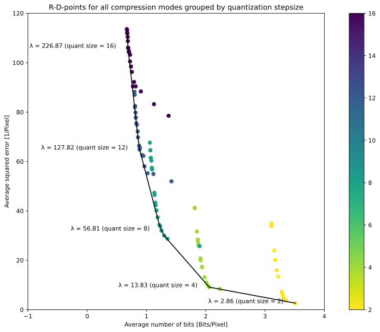
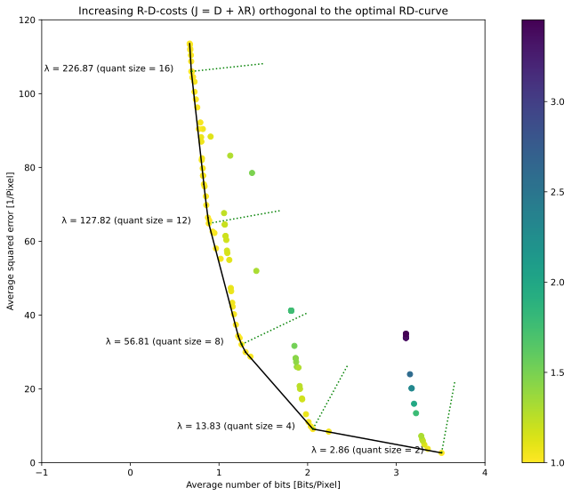

# Aspects of Lagrangian optimization in image compression

In image compressing we generally deal with the question how we can use the highly redundant nature of image data to reduce the memory space needed to save this data. The memory size for raw image data (e.g. data that comes from photo chips) can be enormous. That's why one always tries to compress raw image data. A proven approach is to look at the picture's self-similarities to predict other areas within the image that share a similiar form and color gradient. After predicting a subblock using neighboring content we focus on the difference between prediction and orginal, called the residual. If the prediction is good enough, we should expect a small difference that contains mostly high-frequency details. The comparatively low information density in the residual, in turn, allows us to transform and quantize the residual in order to transfer still less coefficients. However, when the encoder checks different prediction, transform and quantization modes, it must somehow be decided which mode is the best configuration for compression. At this point, many compression standards like JPEG make use of Lagrangian optimization.

## How encoders make decissions

When it comes to image compression, one always has to deal with an interlinked minimization problem: At the same time, we want to minimize the bit rate ($R$) and the squared error ($D$, for distortion) between the compressed and the original image. To solve this minimization problem we can use the Lagrangian approach and instead of minimizing $R$ and $D$ we consider a linear combination $J = D + \lambda R$. The function $J$ is called the Lagrangian function and can be interpreted as a cost value. The lower the coding costs the better is the compression. Thus, we can easily reformulate the minimization problem by only looking at the costs:

$$
J = D + \lambda \cdot R \quad \rightarrow \quad \textrm{min}, \quad \lambda \geq 0
$$

The value $\lambda \geq 0$ is the so-called Lagrangian multiplier and becomes necessary since the output bit rate and the output distortion will not increase/decrease in an ratio of 1:1. Figuratively speaking, we have to add an extra penalty to the bit rate in order to get proper RD costs. In other words, if we know $\lambda$, comparing two compression modes means nothing else than comparing $J(mode1)$ and $J(mode2)$.

However, all compression standards based on rate-distortion-optimization have its own specific Lagrangian multiplier. That is just because different compression algorithms produce different rate-distortion ratios. Consequently, finding the right $\lambda$ is a central task in image compression.

## Determining the Lagrangian multiplier $\lambda$

Let's have a closer look at how we estimate the needed $\lambda$-value(s) for our demo encoder. Since we do not know the specific value yet, the basic idea is to test a whole range of different $\lambda$-values and to run the encoder for a set of $(\lambda, qs)$ pairs. From the mathematical point of view this means we run the encoder with a range of diffrent rate penalties. Each single penalty generates its own $(R(\lambda, qs), D(\lambda, qs))$ RD point. By taking these RD points and plot them in the R-D plane we can eventually calculate $\lambda$ from the resulting Pareto frontier. But let's go through step by step.

First, we start with the test space that contains the $(\lambda, qs)$ pairs. For this encoder we define a test space with $6\cdot 25 = 150$ pairs as follows:

$$
QS \times \Lambda = \{4 + 4i\}_{i=0}^{5} \times \{10 + 40i\}_{i=0}^{24}
$$

Applying the encoder on this test space yields the set of corresponding RD points. This point cloud is plotted in the next figure. There we see that $\lambda$-$qs$ combinations sometimes cause "bad", and sometimes "good" compression results. The bad ones have high bit rates and high distortions (upper right corner), whereas combinations with a good compression gain lie in the bottom left corner (low rates and low squared errors). Since we are interested in the best $\lambda$-values, we look for the $(\lambda, qs)$ pairs with associated $(R, D)$ points on the convex hull, which is plotted as solid line.

 

As in other lossy image coder, on the convex hull we typically have points that only depend on the quantization step size. The corresponding best $\lambda$-values are our desired encoder multiplier and we can generelly estimate them by finding a regression model $\lambda = \lambda({qs}_{best})$. For this kind of image coder, it's also common to discover a quadratic relation between $\lambda_{best}$ and ${qs}_{best}$. For example, looking at the HEVC and VVC standard, one founds

$$
\begin{align*}
qs &= 2 ^ {\frac{QP - 4}{6}} \\
\lambda &= 2 ^ {\frac{QP - 12}{3}},
\end{align*}
$$

what gives us $\lambda \propto qs^2$. For this encoder, $\lambda$ is predicted by using the quadratic regression

$$
\lambda = \lambda_{qs} = 
\begin{cases}
2(qs - 4)^2 + 28, \quad &qs \geq 4, \\
28, \quad &qs < 4 \\
\end{cases}
$$

With this lambda function we sucessfully estimated this encoder's $\lambda$-value and we eventually obtain the coding costs (see second next figure)

$$
J = D(qs, mode) + \lambda(qs) \cdot R(qs, mode)
$$

 

 ## Experiment: Does $\lambda$ depend from partitioning depth?

Because smaller blocks (like 8×8 or 16x16) consume a higher proportion of bits on overhead (such as syntax elements, split flags, etc.) relative to the actual transform residual coefficients, the Lagrangian multiplier is often adjusted to prevent smaller blocks from being overly penalized.

In our demonstration coder the rate overhead in small blocks is admittedly negligible, so the question is whether a $\lambda$ adjustment can achieve better coding gains. For answering that question we start a little rate-distortion experiment.

Suppose $\lambda_{base} = \lambda(qs)$ is the Lagrangian multiplier related to the current quantization step size. For each partitioning depth we update $\lambda_{base}$ according to the follwing model, where $\kappa\geq 0$ denotes an arbitrary constant:

$$
\begin{align*}
\lambda_{depth} &= \lambda_{base} \cdot \left(\frac{W \cdot H}{W_{max} \cdot H_{max}}\right)^\kappa \\
&= \lambda_{base} \cdot \left(\frac{W_{max} \cdot H_{max} \cdot 2^{-2\cdot depth}}{W_{max} \cdot H_{max}}\right)^\kappa \\
&= \lambda_{base} \cdot 2^{-2\cdot depth \cdot \kappa}
\end{align*}
$$

Now we can test this model by choosing different values for $\kappa$. For $\kappa\in\{0, 0.125, 0.25, 0.5, 1\}$ we get the following rate-distortion analysis:

```
         rate        dist  qs      slopes     lambdas  lambda_pred     costs  kappa
625  0.512360  207.169464  24 -808.179071  808.179071   816.367844  1.000000  0.000
500  0.573090  158.088749  20 -537.768892  537.768892   526.348259  1.000000  0.000
375  0.676819  110.424145  16 -306.398491  306.398491   302.101434  1.000000  0.000
376  0.733795   96.392994  16 -306.398491  306.398491   302.101434  1.010103  0.125
250  0.872314   66.406967  12 -131.208955  131.208955   143.627367  1.000000  0.000
130  1.254791   31.311348   8  -45.241874   45.241874    50.926060  1.000000  0.000
0    2.047791    9.360748   4  -25.252836   25.252836    23.997511  1.000000  0.000
1    2.065704    8.978725   4  -25.252836   25.252836    23.997511  1.000818  0.125
2    2.083588    8.879799   4  -25.252836   25.252836    23.997511  1.006463  0.250
3    2.131378    8.616848   4  -25.252836   25.252836    23.997511  1.021571  0.500
4    2.395844    8.336662   4  -25.252836   25.252836    23.997511  1.125265  1.000

Lambda prediction from quantization stepsize:
       2
2.055 x - 17.93 x + 62.84
```

 